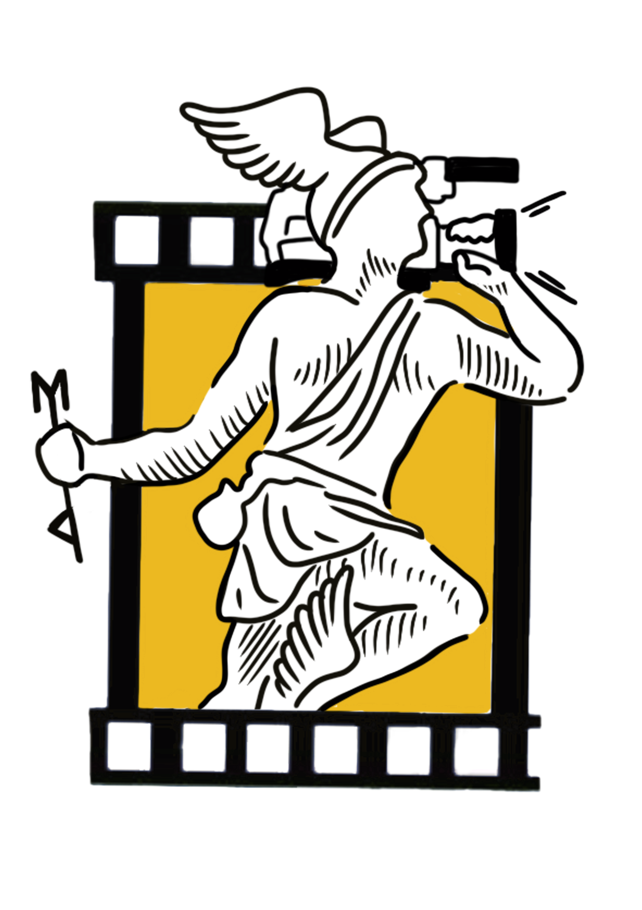

<p align="center">
  
</p>

<h1 align="center">Projeto Hefesto</h1>

<p align="center">
  <strong>Transformando treinamentos em Segurança do Trabalho com Realidade Virtual</strong>
</p>

## Descrição do Projeto

O Projeto Hefesto é uma iniciativa da Mitolog para revolucionar os treinamentos em Segurança do Trabalho utilizando tecnologia avançada de Realidade Virtual (VR). Nosso objetivo é proporcionar simulações imersivas e realísticas para capacitar colaboradores em situações de risco como trabalho em altura, proteção contra incêndios e outras normas regulamentadoras.

## Funcionalidades

- **Simulações Realísticas:** Ambientes virtuais 3D que replicam condições de trabalho perigosas de forma precisa.
  
- **Interface Intuitiva:** Software unificado com interface fácil de navegar para acessar diferentes normas regulamentadoras.
  
- **Personalização de Conteúdo:** Possibilidade de selecionar imagens específicas para cada simulação.

## Tecnologias Utilizadas

- React.js: Biblioteca JavaScript para construção da interface de usuário.
- CSS: Estilização dos componentes e elementos da aplicação.
- Realidade Virtual (VR): Tecnologia para criação de ambientes virtuais imersivos.

## Instalação e Uso

1. **Clone o repositório:**
   ```bash
   git clone https://github.com/seu-usuario/projeto-hefesto.git
